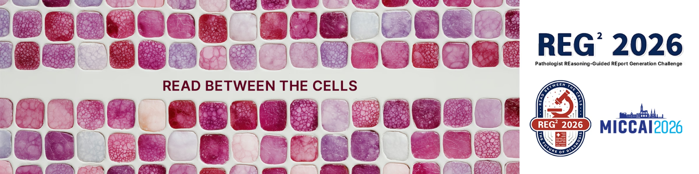

# Pathologist REasoning-Guided REport Generation Challenge (REG2026)

**REG2026** (REG²) is a [Grand Challenge](https://reg2026.grand-challenge.org) competition for pathology **report generation** from gigapixel **whole slide images (WSIs)**, with **diagnostic reasoning** made explicit—not only the final report. It extends REG2025 by evaluating structured reasoning aligned with how pathologists explore slides and decide what is reportable.

The release pairs WSIs (TIFF, 20×) with **chain-of-thought** Q&A and CAP-style report fields (~12K training cases across seven organs). Phases, downloads, rules, and scoring are on the [challenge overview](https://reg2026.grand-challenge.org) and [data description](https://reg2026.grand-challenge.org/data-description/).

## Repository contents

| Directory | What it is |
|-----------|-----------|
| [`algorithm_submission_template/`](algorithm_submission_template/) | Docker container template for submitting your algorithm to Grand Challenge |
| [`submission_evaluation_code/`](submission_evaluation_code/) | Local Docker evaluation harness — run the official scoring logic on your own machine before submitting |

## Getting started

### Submitting an algorithm

1. Open [`algorithm_submission_template/`](algorithm_submission_template/).
2. Follow [`algorithm_submission_template/README.md`](algorithm_submission_template/README.md) (Docker, both task interfaces, local tests, upload).
3. For weights layout, see [`algorithm_submission_template/model/README.md`](algorithm_submission_template/model/README.md).

### Evaluating locally before you submit

Use [`submission_evaluation_code/`](submission_evaluation_code/) to run the same metric A + metric B scoring that the leaderboard uses — entirely on your own machine, with no upload required.

1. Open [`submission_evaluation_code/`](submission_evaluation_code/).
2. Follow [`submission_evaluation_code/README.md`](submission_evaluation_code/README.md) for the full setup (Docker image, judge model weights, data formats, and three-step pipeline).
3. Drop in your own cases and predictions to get a realistic score estimate before the official submission deadline.
